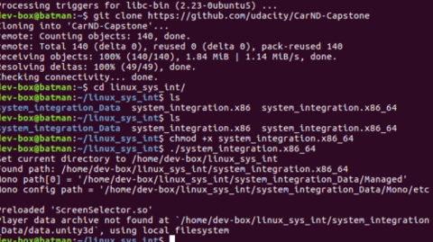
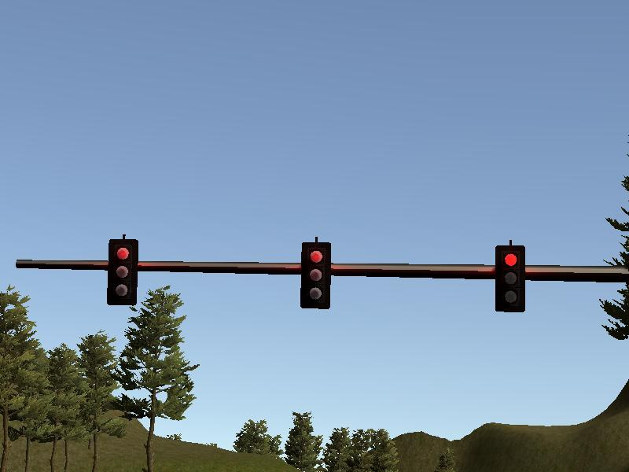
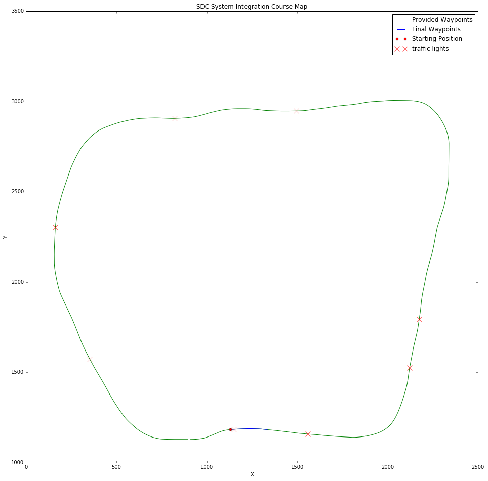

## Udacity Self Driving Car Nanodegree Final Project: System Integration

This is Team Vulture project repo for the final project of the Udacity Self-Driving Car Nanodegree: Programming a Real Self-Driving Car. The project will require the use of Ubuntu Linux (the operating system of Carla) and a new simulator with integration with the Robotic Operation System or ROS.

### The Team
The following are the member of Team Vulture.

* __Team Lead__: John Chen, diyjac@gmail.com
* Rainer Bareiß, rainer_bareiss@gmx.de
* Sebastian Trick, sebastian.trick@gmail.com
* Yuesong Xie, cedric_xie@hotmail.com
* Kungfeng Chen, kunfengchen@live.com

__GO VULTURE!__

### WAYPOINT UPDATER Experimental 1.

* Test code for waypoint_updater.py: looks like the ros node down stream expects local coordinates instead of global.
* Add pygame joystick control to dbw_node.py to observe vehicle behavior on different throttle, brake and steering inputs.

### Installation 

* Be sure that your workstation is running Ubuntu 16.04 Xenial Xerus or Ubuntu 14.04 Trusty Tahir. [Ubuntu downloads can be found here](https://www.ubuntu.com/download/desktop). 
* If using a Virtual Machine to install Ubuntu, use the following configuration as minimum:
  * 2 CPU
  * 2 GB system memory
  * 25 GB of free hard drive space

  The Udacity provided virtual machine has ROS and Dataspeed DBW already installed, so you can skip the next two steps if you are using this.

  __NOTE: *We experienced poor performance using VM, so did not use it for integration and testing.*__

* Follow these instructions to install ROS
  * [ROS Kinetic](http://wiki.ros.org/kinetic/Installation/Ubuntu) if you have Ubuntu 16.04.
  * [ROS Indigo](http://wiki.ros.org/indigo/Installation/Ubuntu) if you have Ubuntu 14.04.
  * [Dataspeed DBW](https://bitbucket.org/DataspeedInc/dbw_mkz_ros)
  * Use this option to install the SDK on a workstation that already has ROS installed: [One Line SDK Install (binary)](https://bitbucket.org/DataspeedInc/dbw_mkz_ros/src/81e63fcc335d7b64139d7482017d6a97b405e250/ROS_SETUP.md?fileviewer=file-view-default)

* Download the [Udacity Simulator](https://github.com/udacity/self-driving-car-sim/releases/tag/v0.1).

    __NOTE__: *If you are installing in native Ubuntu 16.04, the Dataspeed DBW One Line SDK binary install will auto install 4.4.0-92-generic Linux kernel, which will break CUDA and the NVIDIA 375 drivers if you have NVIDIA GPU in your native Ubuntu 16.04 build.  This will cause starting the simulator to fail because it can no longer open the OpenGL drivers provided by NVIDIA:*

    

    *To fix this issue, you will have to:*
    * remove the 4.4.0-92-generic kernel (or any kernel newer than 4.4.0-91-generic):
        ```bash
        sudo apt-get remove linux-image-4.4.0-92-generic
        ```
    * reinstall the NVIDIA 375 drivers (follow the instructions):

        [https://askubuntu.com/questions/760934/graphics-issues-after-while-installing-ubuntu-16-04-16-10-with-nvidia-graphics](https://askubuntu.com/questions/760934/graphics-issues-after-while-installing-ubuntu-16-04-16-10-with-nvidia-graphics)
    
### Usage

1. Clone the project repository
```bash
git clone https://github.com/diyjac/SDC-System-Integration.git
cd SDC-System-Integration
```
2. __OPTIONAL__: Verify, List, Switch or Create your own branch in the repository
    * verify current branch
        ```bash
        git status
        ```
    * list existing branches
        ```bash
        git branch
        ```
    * switch to a different branch
        ```bash
        git checkout <different branch>
        ```
    * create new branch from current branch and push to remote repository
        ```bash
        git checkout -b <your branch>
        git push -u origin <your branch>
        ```
3. Install python dependencies
```bash
pip install -r requirements.txt
```
4. Make and run styx
```bash
cd ros
catkin_make
source devel/setup.bash
roslaunch launch/styx.launch
```
5. Run the simulator
```bash
unzip lights_no_cars.zip
cd lights_no_cars
chmod +x ros_test.x86_64
./ros_test.x86_64
```
6. To test grab a raw camera image
```bash
rosrun tools grabFrontCameraImage.py ../imgs/sampleout.jpg
```


7. To dump the waypoints from the `/base_waypoints` topic
```bash
rosrun tools dumpWaypoints.py ../data/simulator_waypoints.csv
```
8. To dump the final waypoints from the `/final_waypoints` topic
```bash
rosrun tools dumpFinalWaypoints.py ../data/final_waypoints.csv
```


9. To view the diagnostics screen in real-time when the integrated system is running
* __NOTE__: Requires pygame!
```bash
rosrun tools diagScreen.py
```


